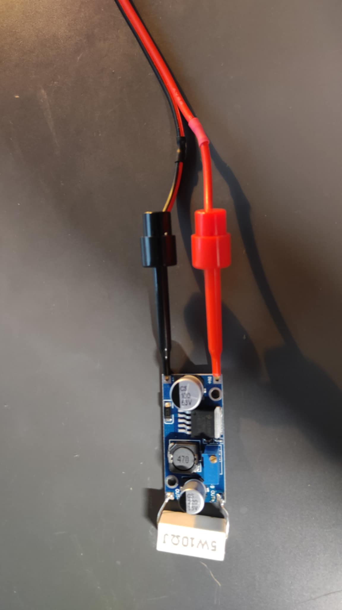
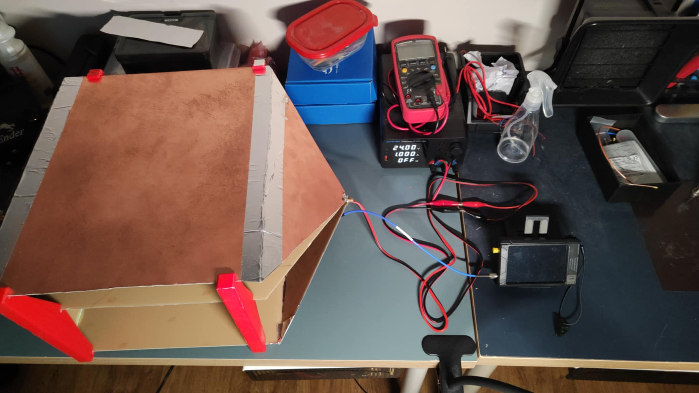
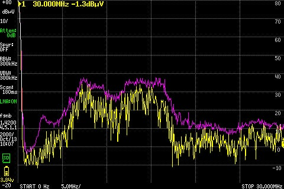
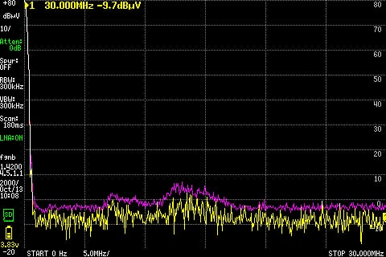
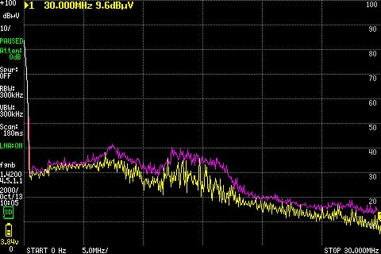
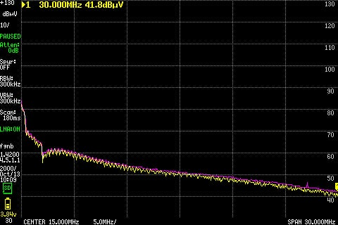
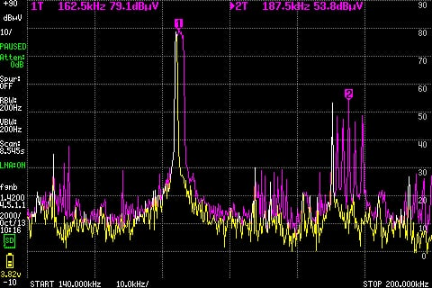
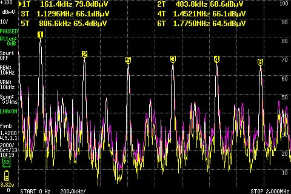
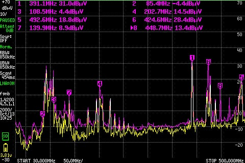
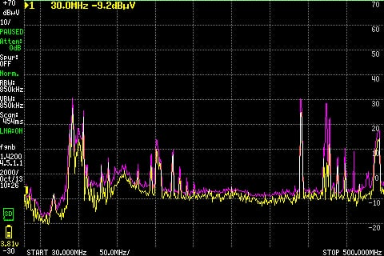

# Project Overview

This project presents an attempt to perform partial EMC tests of an LM2596HV-based step-down module purchased on AliExpress.

# LM2596HV

The LM2596HV is a step-down (buck) voltage regulator with a typical oscillator frequency of 150 kHz.

<b>Figure 1:</b> LM2596HV module with load and power cables

# Test Equipment

The tests were carried out using amateur and DIY equipment, including:

- DIY TEM (transverse electromagnetic) cell based on Petteri Aimonen's design: [GitHub link](https://github.com/PetteriAimonen/tem-cell)
- DIY LISN (Line Impedance Stabilization Network) module also based on Petteri Aimonen's design
- TinySA Ultra spectrum analyzer
- TPS3010 bench power supply

# Test Setup

As shown in Figure 1, the Device Under Test (DUT) was loaded with a 10 Ω resistor. The input voltage was set to 24 V, and the module was configured to step the voltage down to 10 V. This resulted in a current draw of approximately 0.5 A.

<b>Figure 2:</b> Test setup (TEM cell with DUT inside, power supply, LISN, and TinySA Ultra)

<b>Figure 3:</b> DUT inside TEM cell with LISN connected

## Potential Issues with the Setup

Several issues may affect measurement accuracy in this setup:

- Long power delivery cables may pick up background noise.
- A low-quality power supply may inject excessive noise into the system. The LISN’s input low-pass filter should mitigate some of this noise.
- The LISN is based on a trusted external design, but my specific unit has not been verified with lab-grade instruments. Input filter performance, output impedance, and channel isolation remain untested due to lack of access to a lab-grade oscilloscope or signal generator.
- The TEM cell is also based on an external design. Petteri Aimonen recommends using copper tape soldered to the PCB laminate for optimal connection between shield parts. In my case, I used aluminum tape instead, due to limited availability. While it provides some continuity, the quality of the shielding connection is questionable. I plan to replace it with copper tape in the future.

## Tests Performed

- Conducted emissions (common-mode and differential-mode)
- Radiated emissions

# Conducted Emissions

## Background Noise

<b>Figure 4:</b> Common-mode background noise in conducted emissions measurements

A significant noise background was observed during the common-mode measurements. The likely cause of this noise is the length of the cables supplying power to the LISN input. These cables may act as antennas and pick up interference from nearby devices.

<b>Figure 5:</b> Differential-mode background noise in conducted emissions measurements

In the differential-mode measurements, the background noise is significantly lower. This is likely due to the much shorter cables used to connect the LISN output to the DUT inside the TEM cell.

## Conducted Emissions Measurements

<b>Figure 6:</b> Common-mode conducted emissions of the DUT

The common-mode conducted emissions show considerable noise across the entire frequency range. Background noise is also clearly visible in the measurement.

<b>Figure 7:</b> Differential-mode conducted emissions of the DUT

The differential-mode conducted emissions also exhibit significant noise throughout the entire spectrum. The spectrum contains multiple harmonics and interharmonics of the IC’s 150 kHz oscillator frequency. One noticeable dip in the emission levels was observed, likely caused by the cable supplying power to the DUT. In earlier tests, when a longer cable was used, additional and deeper notches appeared in the spectrum—suggesting cable resonance effects or impedance mismatches influencing emission behavior.

## IC Oscillator Frequency

<b>Figure 8:</b> Measurement of the IC’s main oscillator frequency

A peak was observed at 162 kHz, which is likely caused by the IC's main switching frequency. While this does not exactly match the nominal 150 kHz, the datasheet specifies 150 kHz as a typical value, with the actual oscillator frequency ranging from 133 kHz to 168 kHz.

<b>Figure 9:</b> Harmonics of the oscillator frequency

Harmonics of the 162 kHz switching frequency were observed across a wider frequency range.

# Radiated Emissions

## Background Noise

<b>Figure 10:</b> Background noise in radiated emissions measurements

Significant background noise was observed during the measurement of the signal inside the empty TEM cell. Open TEM cells naturally pick up ambient radio signals from the environment. Noise at certain frequencies was much more prominent than at others. The following peaks were identified:

- Markers 2 to 3 – FM radio signals (88 MHz to 108 MHz)
- Marker 1 – TETRA communication around 390 MHz (used in Poland by public services such as the police)
- Markers 4 to 7 – Other sources, such as communication systems, TV broadcasts, and local mobile operators

This elevated background noise is likely due to poor electrical connection between parts of the TEM cell shielding.

## Radiated Emissions Measurement

<b>Figure 11:</b> Radiated emissions of the DUT

Some increase in noise levels was observed in the lower frequency range. However, due to the high background noise, it is difficult to clearly distinguish emissions originating from the DUT.

